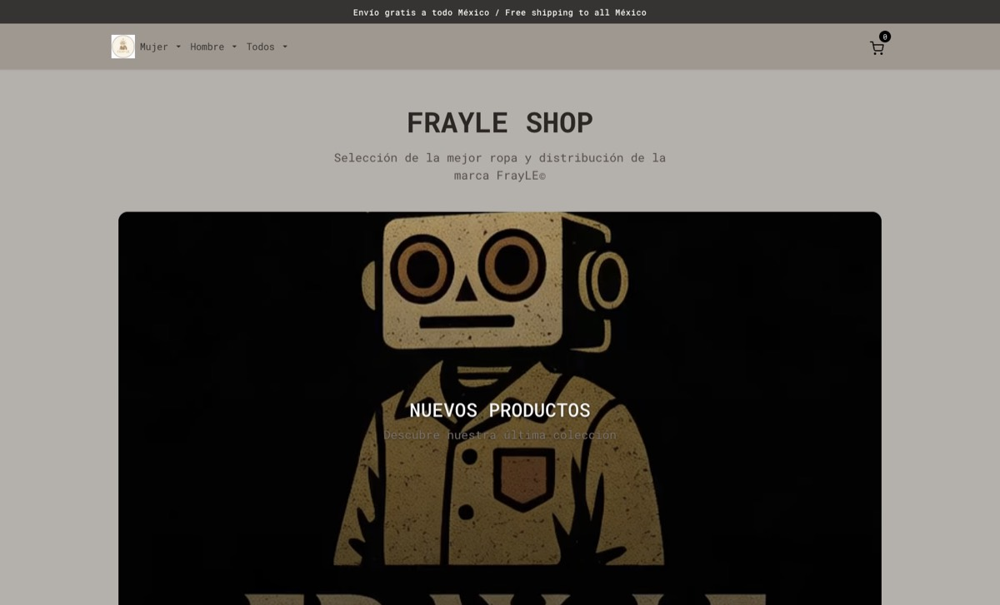

# 🛍️ FrayLE Shop - E-commerce de Streetwear Premium


FrayLE Shop es un e-commerce moderno y elegante especializado en streetwear premium, diseñado con las mejores prácticas de desarrollo frontend y una experiencia de usuario excepcional.

## ✨ Características

- **Diseño Responsivo**: Adaptado perfectamente a todos los dispositivos (mobile-first)
- **Menú Hamburguesa**: Navegación intuitiva con categorías y subcategorías
- **Carrito de Compras**: Funcionalidad completa con sistema de descuentos (10% y 12%)
- **Interfaz Moderna**: Diseño limpio y atractivo con animaciones suaves
- **Optimizado**: Rendimiento optimizado con lazy loading de imágenes

## 📸 Capturas de pantalla



Home de FrayLE Shop — catálogo con carrito.

## 🛠️ Tecnologías Utilizadas

- **HTML5**: Estructura semántica y accesible
- **SASS/SCSS**: Preprocesador CSS con metodología BEM
- **JavaScript ES6+**: Interactividad y manipulación del DOM
- **Bootstrap 5**: Framework CSS para componentes responsivos
- **Feather Icons**: Iconografía elegante y consistente
- **GitHub Pages**: Despliegue automatizado

## 📦 Estructura del Proyecto

```
e_comer 2/
├── css/
│   ├── base/
│   │   ├── _reset.scss
│   │   └── _variables.scss
│   ├── components/
│   │   ├── _cards.scss
│   │   └── _modal.scss
│   ├── layout/
│   │   ├── _grid.scss
│   │   └── _header.scss
│   ├── styles.css
│   └── styles.scss
├── img/
│   ├── logofrayle.png
│   ├── NBA.png
│   ├── off-white.png
│   ├── travis.png
│   └── videologo.mp4
├── js/
│   └── main.js
├── index.html
└── README.md
```

## 🚀 Instalación y Uso

1. **Clona el repositorio**:

   ```bash
   git clone https://github.com/pipeTawns-x/e-comerce.git
   ```

2. **Abre el proyecto**:

   ```bash
   cd e-comerce
   ```

3. **Abre en tu navegador**:

   - Abre el archivo `index.html` directamente en tu navegador
   - O utiliza un servidor local:

   ```bash
   # Con Python
   python -m http.server 8000

   # Con Node.js
   npx serve
   ```

## 🌐 Despliegue

El sitio está desplegado en **GitHub Pages** y disponible en:

### 🔗 [https://pipetawns-x.github.io/e-comerce/](https://pipetawns-x.github.io/e-comerce/)

## 📋 Funcionalidades JavaScript

1. **Sistema de Carrito**:

   - Agregar/eliminar productos
   - Cálculo automático de totales
   - Sistema de descuentos escalonado (10% para 3+ items, 12% para 4+ items)
   - Persistencia de datos durante la sesión

2. **Navegación Responsiva**:

   - Menú hamburguesa funcional con categorías desplegables
   - Comportamiento inteligente al hacer scroll

3. **Interacciones de UI**:
   - Notificaciones toast para acciones del usuario
   - Modales interactivos
   - Animaciones y transiciones suaves

## 🎨 Metodología y Estructura

- **BEM (Block Element Modifier)**: Nomenclatura consistente en CSS
- **Mobile-First**: Enfoque responsivo desde dispositivos móviles
- **SCSS Modular**: Arquitectura escalable y mantenible
- **Semántica HTML**: Estructura significativa y accesible

## 📱 Compatibilidad

- ✅ Chrome (versiones recientes)
- ✅ Firefox (versiones recientes)
- ✅ Safari (versiones recientes)
- ✅ Edge (versiones recientes)
- ✅ Dispositivos móviles (iOS y Android)

## 🤝 Contribución

Las contribuciones son bienvenidas. Para cambios importantes:

1. Haz un Fork del proyecto
2. Crea una rama para tu feature (`git checkout -b feature/AmazingFeature`)
3. Commit tus cambios (`git commit -m 'Add some AmazingFeature'`)
4. Push a la rama (`git push origin feature/AmazingFeature`)
5. Abre un Pull Request

## 📄 Licencia

Este proyecto está bajo la Licencia MIT. Ver el archivo `LICENSE` para más detalles.

## 👨‍💻 Autor

**pipeTawns-x** - [GitHub](https://github.com/pipeTawns-x)

## 🎯 Próximas Mejoras

- [ ] Integración con pasarela de pagos
- [ ] Sistema de autenticación de usuarios
- [ ] Panel de administración
- [ ] Modo oscuro
- [ ] Búsqueda y filtrado avanzado
- [ ] Reviews y valoraciones de productos

---

⭐ ¡Dale una estrella al repositorio si te gustó el proyecto!
